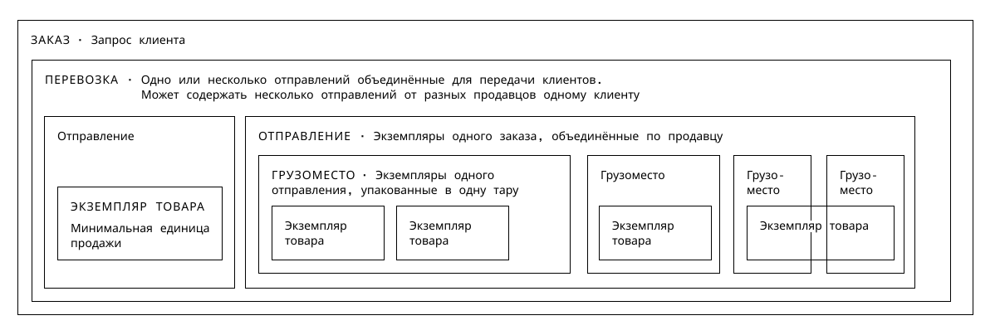
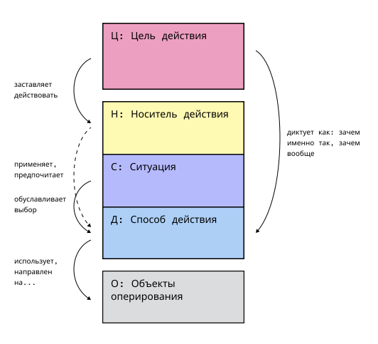
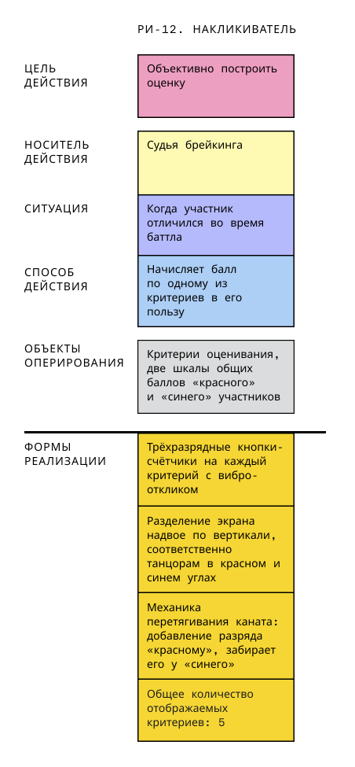
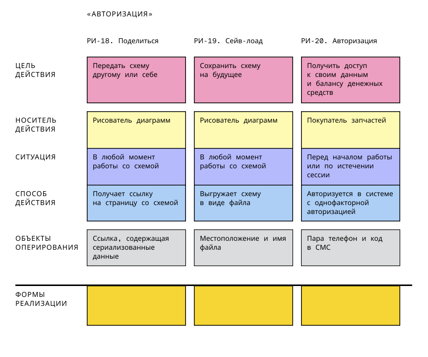

# Карта реализации историй

Карта реализации историй, КРИ — технология сбора требований и проектирования через запись текстовых модели поведения людей в их жизненных и рабочих ситуациях, а также формат результирующей карты.

Задач карты — выявить сценарии использования, подчинённые целям деятельности и её особенностям, и определить наилучшую форму их технической реализации. Описанный метод даёт язык и форму для направления общения в рабочей группе.

## Рабочие истории

Рабочие истории — основные строительныи кирпичики Карты реализации историй. В них через строго структурированный текст описывается поведение человека или операция машины, характерные для одного шага деятельности.

### Элементы рабочей истории

Рабочая история состоит из пяти элементов, записанных в форме словосочетаний, отвечающих на соответствующий вопрос. Каждый элемент рабочей истории записывается с новой строки в формате текстовых предложений или в отдельной карточке карты.

Вот порядок элементов рабочей истории и их суть.

- Цель действия (Ц). Отвечает на вопросы «Зачем вообще с точки зрения деятельности делается?» и «Зачем именно таким способом?»
- Носитель действия (Н). Отвечает на вопрос «Кто действует или какой части машины вменена операция»?
- Ситуация (С). Отвечает на вопрос «Когда, при каких обстоятельствах происходит шаг?»
- Способ действия (Д). Отвечает на вопрос «Каким именно образом выполняется шаг?»
- Объекты оперирования «до» и «после» шага (О и O’). Отвечают на вопросы «С чем работает носитель действия?» и «Что получается в качестве продукта действия?». Допустима краткая форма с ответом только на первый вопрос.

### Шаблон рабочей истории

Формат записи в виде предложений:

> Н: <носитель действия> \
> С: <ситуация> \
> Д: <способ действия> \
> О: <объекты оперирования> \
> Ц: <цель действия>

В общем виде читается так

> <Кто-то или что-то>, \
> <В такой-то ситуации> \
> <Действует таким-то образом>, \
> Преобразуя <такие-то объекты оперирования на входе шага> в <такие-то объекты на выходе>, \
> Для обеспечения <такой-то цели на уровне деятельности как целого>

Краткая форма записи шаблона:

> **Н** в **С** выполняет **Д,** меняя **О** на **O'** для **Ц**

### Примеры рабочих историй

> Н: Манипулятор с компьютерным зрением \
> С: Перед поступлением овощей к оператору-человеку \
> Д: Отделяет неспелые овощей от спелых на основании их цвета, формы и размера, \
> О: Преобразуя неотсортированный набор овощей в отсортированный, \
> Ц: Для сокращения нагрузки и времени работы на конвейере

 

> Н: Обладатель браслета, \
> С: Когда важно не проспать в пределах получаса-часа, перед тем как лечь спать, \
> Д: Определяет желаемый объём сна,\
> О: Управляя минимальным числом фаз сна и его продолжительностью, \
> Ц: Чтобы успеть к назначенному времени и выспаться лучше за счёт учёта фаз сна

 

> Н: Спикер \
> С: На время своего очного выступления \
> Д: Открывает аудитории доступ к своей контактной информации, \
> О: Преобразуя состояние доступности своих контактных данных из закрытого в открытое, \
> Ц: Чтобы массово раздать свою контактную информацию и обеспечить её актуальность в будущем

## Структура Карты реализации историй

Карта имеет матричную структуру и ориентирует свои элементы в двух направлениях. Слева направо — в логике следования процесса. Сверху вниз — в логике подчинения функции.

Каждая история формирует столбец из пять карточек составленных сверху внизу в порядке, указанном выше. Каждой истории в соответствие ставится набор карточеки форм реализации. Они располагаются под столбцом истории после черты.

## Инструменты картирования

- [Социотех](https://sociotech.center/) — полная поддержка Карты реализации историй на уровне сценариев и структуры данных, спроектированная автором технологии.
- Шаблоны Карты реализации историй для электронных досок
  - [Holst.so](https://app.holst.so/board/template/5449dc46-18e7-4962-9b2b-81ac4021d40d)
  - [Figma](https://www.figma.com/community/file/1449066171871911721)
  - [Miro](https://miro.com/miroverse/story-implementation-mapping-sim/)
- Шаблоны Карты реализации историй для электронных таблиц
  - [Numbers](https://github.com/Byndyusoft/sim/raw/refs/heads/main/templates/sim-template.numbers)
  - [Excel](https://github.com/Byndyusoft/sim/raw/refs/heads/main/templates/sim-template.xlsx)

## Материалы для самообучения

- [База знаний КРИ](https://github.com/Byndyusoft/sim) — *вы здесь*
- Книга «[Рабочие истории](https://ashapiro.ru/sim-book). Системное проектирование
с Картой реализации историй»
- [Первая статья](https://ashapiro.ru/articles/sim) о Карте реализации историй
- [Доклады и вебинары](https://ashapiro.ru/talks#!/tfeeds/981100993011/c/%D0%9A%D0%B0%D1%80%D1%82%D0%B0%20%D1%80%D0%B5%D0%B0%D0%BB%D0%B8%D0%B7%D0%B0%D1%86%D0%B8%D0%B8%20%D0%B8%D1%81%D1%82%D0%BE%D1%80%D0%B8%D0%B9) автора метода
- [Подкаст make sense](https://makesense.mave.digital/ep-327), где Андрей Шапиро беседует с Юрием Агеевым о эволюции подхода пользовательских историй до рабочих историй

## Сообщество
- Каналы КРИ 
  - [в Телеграм](https://t.me/simapping) 
  - [в ВКонтакте](https://vk.com/simapping)
- [Чат](https://t.me/simap_chat) о КРИ в Телеграм

## Обучение Карте реализации историй
- Мини-курс по Карте реализации историй — *скоро*

---

# Тонкости технологии

Раздел для тех, кто уже собрал первую карту и хочет уточнить детали: как именно записывать элементы в сложных случаях, откуда берётся порядок слоёв карты и как устроены её слои глубже матрицы.

## Уточнения к элементам

**Носитель действия** записывается одним из трёх способов, в зависимости от того, чем определяется его поведение:
- функциональная роль (покупатель, продавец, рекламодатель) — когда поведение определяется характером интересов;
- позиция в системе разделения труда (логист, кладовщик, дизайнер) — когда для действия нужны специфические знания и навыки;
- техническая система или её часть — когда действие передано машине.

Конкретные люди по именам не используются. Отдельный приём — **инверсия носителя**: в качестве носителя записывается «Система», чтобы отразить потребность бизнеса воздействовать на пользователя, а не потребность самого пользователя. Применять этот приём стоит только тогда, когда для шага объективно нельзя найти человека-носителя с собственным интересом; по умолчанию нужно искать человека. Пример:

> Н: Система \
> С: Во время демо-доступа и в первый год подписки \
> Д: Последовательно демонстрирует неиспользуемые функции, \
> О: Работая с анимацией, названием и кратким описанием функций, их местонахождением в интерфейсе, \
> Ц: Чтобы сформировать у пользователя привычку пользоваться незнакомыми инструментами продукта

**Ситуация** задаёт условие, при котором способ действия становится нужным именно таким, а не иным. Если ситуация кажется постоянной, это стоит зафиксировать явно — заполнителем вида «Всегда» — и проверить, не появляются ли на самом деле исключения, которые эту постоянность опровергают.

**Способ действия** — это принцип организации операций, а не конкретный инструмент. Формулировка очищается от названий интерфейсных элементов и ИТ-терминов («нажимает кнопку», «открывает форму», «авторизуется через OAuth») в пользу сути происходящего («подаёт команду», «размещает описание», «уточняет порядок записей по критерию»). Принцип ищут через сопоставление нескольких реальных вариантов поведения — в них находят общую закономерность.

**Объекты оперирования** записываются в одном из двух форматов: простым перечислением («работая с …», «управляя …») или как преобразование входа в выход («преобразуя … в …»). Если объекты — это данные, за ними стоит поискать объект-первоисточник в реальном мире: строка в базе данных — это тень какого-то реального товара, документа или события. Для сложных объектов имеет смысл строить дополнительные схемы:
- **схему состава** — раскрывает внутреннюю структуру сущности по принципу MECE (части взаимно исключают и совместно исчерпывают целое);
- **схему отношений** — показывает связи между агентами и сущностями, где имена агентов заменены их функциональными ролями, а подписи на линиях — типом отношения;
- **схему организованности деятельности** — самый подробный тип, рассматривающий бизнес-функции агентов в ландшафте конструкций деятельности (склады, системы, документы, процессы).

Пример схемы состава — разложение заказа на грузоместа и экземпляры товара по принципу MECE:

## Принцип каскада реализации

Вышестоящие элементы столбца формируют содержание нижестоящих — как формочка задаёт форму песочной пироженки. Каждый следующий слой отвечает на вопрос «как будет организовано то, что затребовано выше?». Поэтому работа с картой всегда идёт от необходимого (Цель) к приемлемо возможному (Формы реализации): решения на нижних слоях выбираются не как «совершенные», а как наименьшие достаточные для того, что задано выше.

Связи между соседними слоями не абстрактны, а вполне конкретны — каждый слой диктует следующему определённым образом:

## Опускание карточек

Чтобы карта оставалась компактной, часть карточек можно не повторять в соседних столбцах, если они наследуются от истории слева:
- Цель действия и Носитель действия можно опускать, если они не изменились;
- Ситуацию можно опустить только тогда, когда она — «Всегда»;
- Способ действия, Объекты оперирования и всё, что ниже черты, опускать нельзя — это несущие элементы конкретного шага.

### Слой форм реализации

Располагается под чертой в каждом столбце и уточняет, как именно шаг может быть реализован технически. В нём фиксируются:
- **допущения** — принятые решения о природе предметной области (например, «Луна — твёрдая»);
- **кандидатные решения** — конкретные технологии, модули, компоненты («выбиралка диапазона дат», «микросервис платежа»);
- **контрольные списки приёмочных тестов** — условия, по которым реализацию можно считать состоявшейся.

Если вариантов реализации несколько, их нумеруют («Вариант 1», «В-т 2» и т. д.), не выбирая один вместо фиксации альтернатив преждевременно.

## Слой структуры интерфейса

Ещё один слой под чертой — смысловая (не пространственная) группировка информационных объектов, вытекающая из Объектов оперирования конкретной истории:
1. из Объектов оперирования выделяется минимально необходимый набор информационных объектов;
2. каждому объекту присваивается тип — 👀 визуализатор (то, что показывают) или 🕹 манипулятор (то, чем управляют);
3. объекты группируются по смыслу, группам даются имена;
4. по возможности указывается местоположение в интерфейсе — название экрана или контекст, где объект появляется.

## Навигация по карте

Для ориентации в большой карте используются три понятия:
- **Этап** — именованная последовательность историй с единым смыслом (например, «Подготовка к новому дню»);
- **Алиас** — краткое (1–3 слова) название конкретной истории (например, «Накликиватель»);
- **Нумерация** — сквозной номер истории (например, РИ-12 или 3.12), по которому на неё можно сослаться в обсуждении.

Пример истории с алиасом «Накликиватель»:

Пример этапа «Авторизация» из трёх связанных историй с нумерацией и алиасами:

## Критерии готовности рабочей истории

История считается готовой, если по каждому элементу можно ответить «да»:

**Цель действия**
- Отвечает на «Зачем вообще?» — вклад шага в деятельность как целое
- Отвечает на «Зачем именно так?» — обоснование выбранного Способа
- Это не промежуточное условие перехода и не ограничение

**Носитель действия**
- Указана роль или позиция, а не имя человека
- Набор знаний и навыков носителя соответствует описанному действию
- Носитель — участник деятельности, а не разработчик или проектировщик системы

**Ситуация**
- Задаёт конкретный, распознаваемый извне контекст наступления истории
- Если её убрать, логика истории меняется — иначе содержание стоит удалить

**Способ действия**
- Описывает принцип, а не конкретный инструмент
- Не содержит ИТ-терминов и названий интерфейсных элементов
- Связь «зачем именно так» с Целью очевидна

**Объекты оперирования**
- Перечислены, или указано преобразование «до» → «после»
- Согласованы со Способом действия
- Если объекты — данные, указан их первоисточник в реальном мире

**Форма реализации**
- Есть хотя бы один вариант
- Вариант логически отвечает потребности, описанной в истории

**История в целом**
- Все пять элементов заполнены или помечены заполнителями
- Между элементами нет противоречий
- Смысл истории ясен всем участникам рабочей группы

## Типовые ошибки

| Ошибка | Суть | Исправление |
|---|---|---|
| Форма реализации в Способе | «Нажимает кнопку», «Применяет фильтр» | Поднять до принципа: «Подаёт команду», «Находит записи» |
| Неуточнённая Ситуация | «Когда понимает, что…» — неясно, как именно | Записать объективные признаки наступления ситуации |
| Мелкая Цель действия | «Чтобы продолжить работу» | Задать вопрос «Зачем? Чтобы что?» несколько раз подряд |
| Чужая Цель действия | Цель бизнеса приписана пользователю | Переписать под интересы носителя или применить инверсию носителя |
| Ложный Носитель | История написана для разработчика или проектировщика | Найти участника деятельности, для которого делается изменение |
| ИТ-терминология в истории | «ТСД», «сервер», «авторизация через OAuth» | Убрать в Формы реализации, в истории оставить суть |
| Дублирование историй | Две почти одинаковые истории из-за мелкого различия в Ситуации | Объединить в одну, различие перенести в Форму реализации |
| Неоднородный масштаб | Один шаг — целый продукт, другой — нажатие кнопки | Выбрать единый уровень масштаба и держать его по всей карте |

---

Автор технологии — [Андрей Шапиро](https://ashapiro.ru)
Страница КРИ на сайте автора — ...
