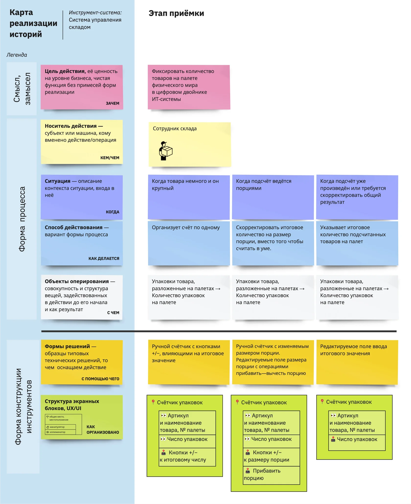
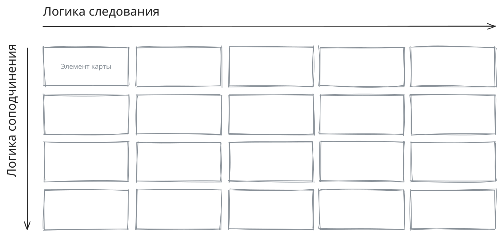
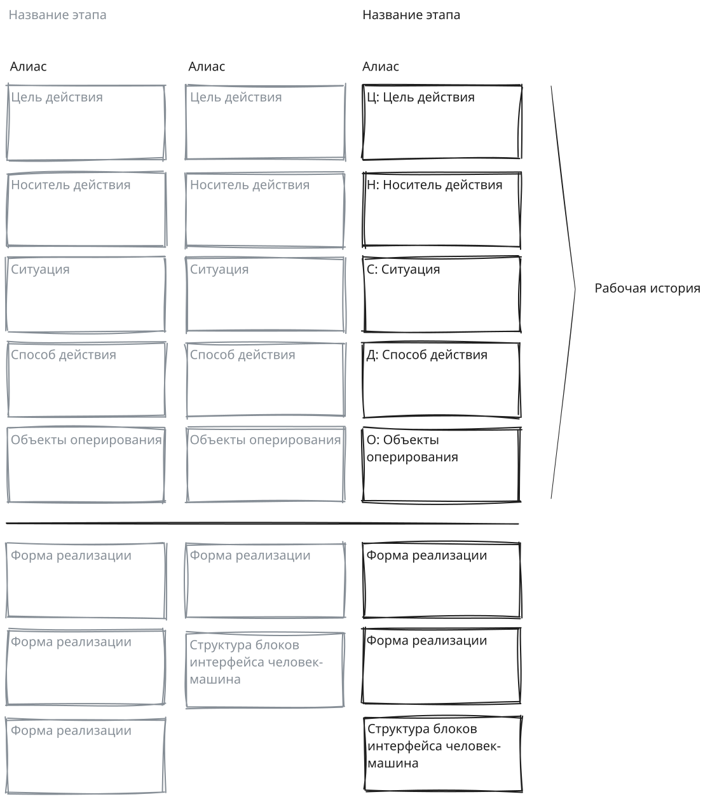

# Карта реализации историй

Карта реализации историй, КРИ — технология сбора требований и проектирования через запись текстовых модели поведения людей в их жизненных и рабочих ситуациях, а также формат результирующей карты.

Задач карты — выявить сценарии использования, подчинённые целям деятельности и её особенностям, и определить наилучшую форму их технической реализации. Описанный метод даёт язык и форму для направления общения в рабочей группе.

## Рабочие истории

Рабочие истории — основные строительныи кирпичики Карты реализации историй. В них через строго структурированный текст описывается поведение человека или операция машины, характерные для одного шага деятельности.

### Элементы рабочей истории

Рабочая история состоит из пяти элементов, записанных в форме словосочетаний, отвечающих на соответствующий вопрос. Каждый элемент рабочей истории записывается с новой строки в формате текстовых предложений или в отдельной карточке карты.

Вот порядок элементов рабочей истории и их суть.

- Цель действия (Ц). Отвечает на вопросы «Зачем вообще с точки зрения деятельности делается?» и «Зачем именно таким способом?»
- Носитель действия (Н). Отвечает на вопрос «Кто действует или какой части машины вменена операция»?
- Ситуация (С). Отвечает на вопрос «Когда, при каких обстоятельствах происходит шаг?»
- Способ действия (Д). Отвечает на вопрос «Каким именно образом выполняется шаг?»
- Объекты оперирования «до» и «после» шага (О и O’). Отвечают на вопросы «С чем работает носитель действия?» и «Что получается в качестве продукта действия?». Допустима краткая форма с ответом только на первый вопрос.

### Шаблон рабочей истории

Формат записи в виде предложений:

> Н: <носитель действия> \
> С: <ситуация> \
> Д: <способ действия \
> О: <объекты оперирования> \
> Ц: <цель действия>

В общем виде читается так

> <Кто-то или что-то>, \
> <В такой-то ситуации> \
> <Действует таким-то образом>, \
> Преобразуя <такие-то объекты оперирования на входе шага> в <такие-то объекты на выходе>,\
> Для обеспечения <такой-то цели на уровне деятельности как целого>

Краткая форма записи шаблона:

> **Н** в **С** выполняет **Д,** меняя **О** на **O'** для **Ц**

### Примеры рабочих историй

> Н: Манипулятор с компьютерным зрением \
> С: Перед поступлением овощей к оператору-человеку \
> Д: Отделяет неспелые овощей от спелых на основании их цвета, формы и размера, \
> О: Преобразуя неотсортированный набор овощей в отсортированный, \
> Ц: Для сокращения нагрузки и времени работы на конвейере

 

> Н: Обладатель браслета, \
> С: Когда важно не проспать в пределах получаса-часа, перед > тем как лечь спать, \
> Д: Определяет желаемый объём сна,\
> О: Управляя минимальным числом фаз сна и его > продолжительностью, \
> Ц: Чтобы успеть к назначенному времени и выспаться лучше за счёт учёта фаз сна

 

> Н: Спикер \
> С: На время своего очного выступления \
> Д: Открывает аудитории доступ к своей контактной > информации, \
> О: Преобразуя состояние доступности своих контактных > данных из закрытого в открытое, \
> Ц: Чтобы массово раздать свою контактную информацию и > обеспечить её актуальность в будущем

## Структура Карты реализации историй

Карта имеет матричную структуру и ориентирует свои элементы в двух направлениях. Слева направо — в логике следования процесса. Сверху вниз — в логике подчинения функции.

Каждая история формирует столбец из пять карточек составленных сверху внизу в порядке, указанном выше. Каждой истории в соответствие ставится набор карточеки форм реализации. Они располагаются под столбцом истории после черты.

## Материалы по Карте реализации историй

- [Доклады и вебинары](https://ashapiro.ru/talks#!/tfeeds/981100993011/c/%D0%9A%D0%B0%D1%80%D1%82%D0%B0%20%D1%80%D0%B5%D0%B0%D0%BB%D0%B8%D0%B7%D0%B0%D1%86%D0%B8%D0%B8%20%D0%B8%D1%81%D1%82%D0%BE%D1%80%D0%B8%D0%B9) автора метода
- [ Первая статья](https://ashapiro.ru/articles/sim) о Карте реализации историй
- [Подкаст об историях](https://music.yandex.ru/album/6842874/track/130760365/) в КРИ с Юрием Агеевым
- Книга «Рабочие истории. Проектирование через текстовые модели поведения с Картой реализации историй» — в работе
- Шаблоны КРИ
  - [Holst.so](https://app.holst.so/board/template/5449dc46-18e7-4962-9b2b-81ac4021d40d)
  - [Figma](https://www.figma.com/community/file/1449066171871911721)
  - [Miro](https://miro.com/miroverse/story-implementation-mapping-sim/)
  - [Numbers](templates/sim-template.numbers)
  - [Excel](templates/sim-template.xlsx)

---

Автор метода — [Андрей Шапиро](https://ashapiro.ru)
